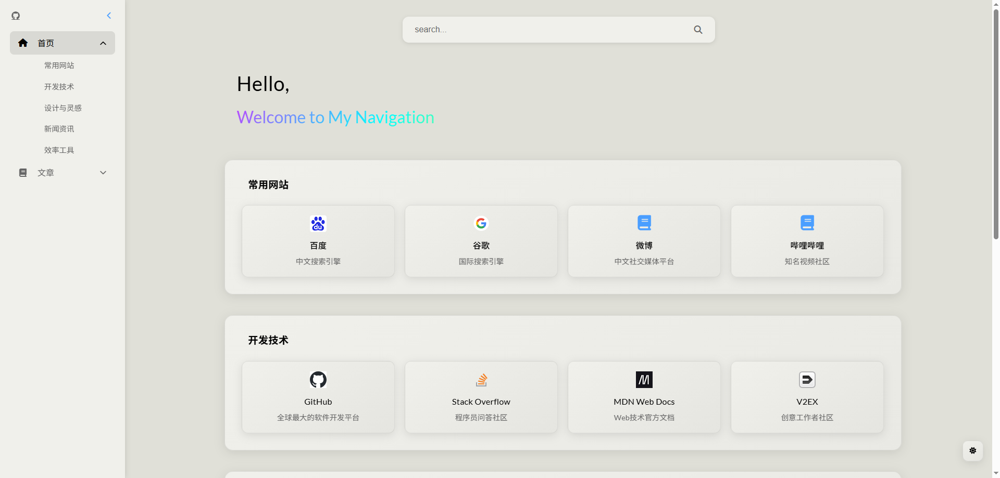
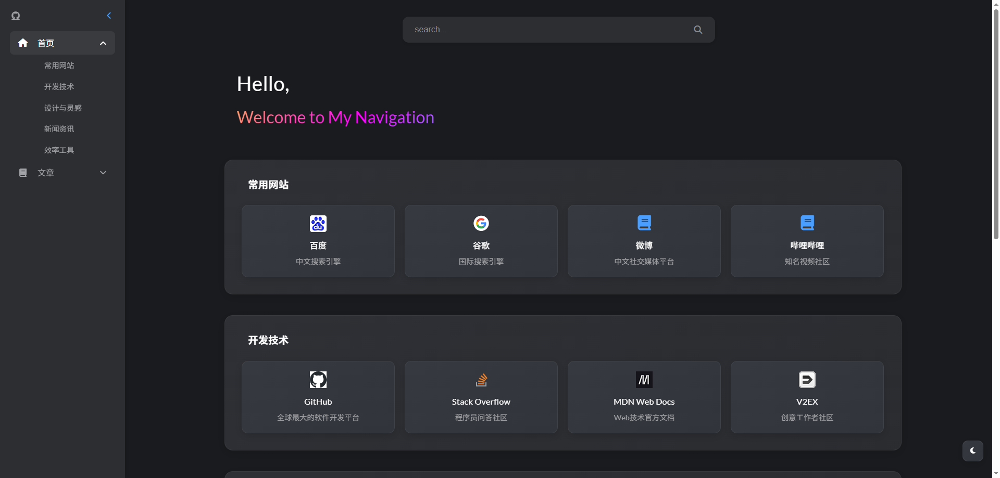
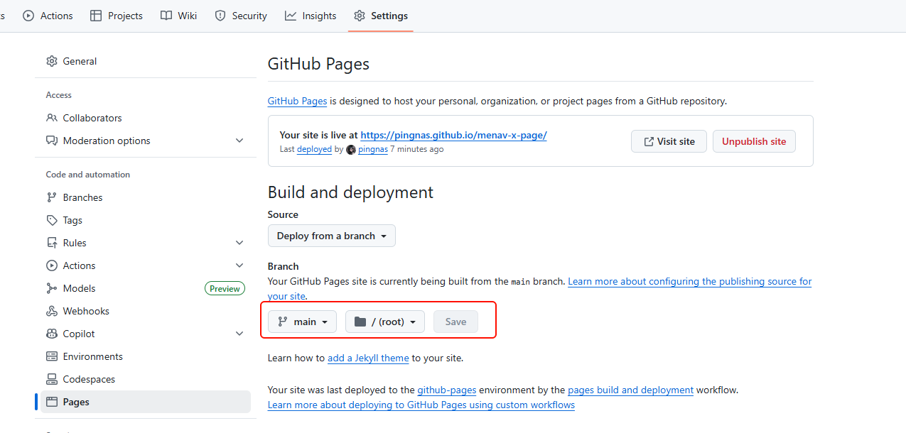
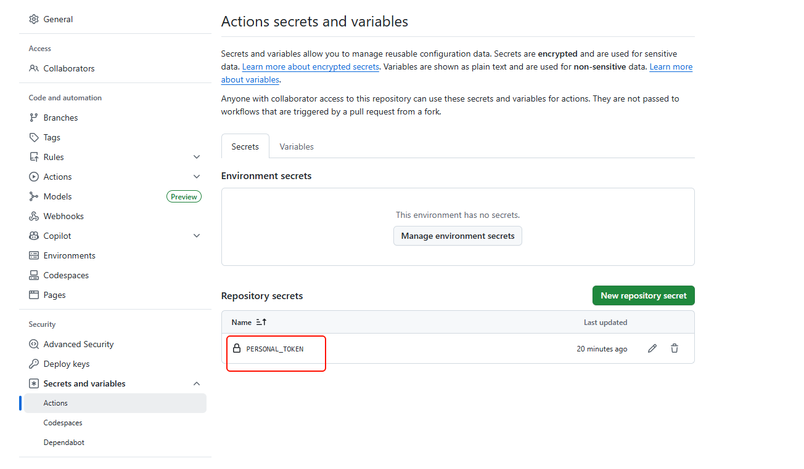

# MeNav-X
本项目基于  **https://github.com/rbetree/menav**  的二次开发,特此向以下原始项目团队及其团队致以最诚挚的谢意。

## 版权与许可 (License & Copyright)

本软件 MeNav-X 及其修改，根据 **GNU Affero General Public License Version 3 (AGPL-3.0)** 许可证条款发布。

**原始项目版权：**
Copyright (C) 2023 [rbetree](https://github.com/rbetree)

**本项目版权：**
Copyright (C) 2025 [pingnas](https://github.com/pingnas)

# 介绍

<div align="center">
  
  <h1>MeNav-X - 个人导航站</h1>
  <p>
    一个轻量级、高度可定制的个人导航网站生成器
    <br />
    <i>⚡ 一键部署 自动化构建 轻松创建属于自己的导航主页</i>
  </p>
</div>

📋 一键部署的静态个人导航站 | ⚡ 自动化构建 | 🔖 支持书签导入

> MeNav是一个轻量级、高度可定制的个人导航网站生成器，让您轻松创建属于自己的导航主页。无需数据库和后端服务，完全静态部署，支持一键Fork部署到GitHub Pages。

如果觉得项目有用，欢迎⭐Star/Fork支持，谢谢！
## 预览

<table>
  <tr>
    <td><b>明亮主题</b></td>
    <td><b>黑暗主题</b></td>
  </tr>
  <tr>
    <td></td>
    <td></td>
  </tr>
</table>

## 配置介绍

在加载配置时遵循以下优先级顺序：
1. `config/user/` （模块化用户配置）（优先级最高）
2. `config/_default/` （模块化默认配置）

> **🔔 提示：** 建议在`config/user/`目录下创建并使用您自己的配置文件，不要直接修改默认配置文件。当然也可以不接受建议。

### 配置 (非常简单)
- 创建`config/user`目录
- 在`config/user`下，必须创建`site.yml`和`navigation.yml`
- 创建`config/user/pages` 目录 - 各页面的内容配置

### site.yml

```yml
title: Navigation # 网站标题，显示在浏览器标签和页面顶部
 
profile:
  title: Hello, # home 页主标题
  subtitle: Welcome to My Navigation # home 页副标题

githubrep: https://github.com/ # 菜单栏上面的github链接地址
```

### navigation.yml

```yml
- name: 首页
  icon: fas fa-home
  id: home
  active: true
- name: 文章
  icon: fas fa-book
  id: articles
```

### pages

#### home
```yml
template: home

categories:
  - name: 常用网站
    sites:
      - name: 百度
        description: 中文搜索引擎
        url: https://www.baidu.com/
      - name: 谷歌
        description: 国际搜索引擎
        url: https://www.google.com/
      - name: 微博
        description: 中文社交媒体平台
        icon: fas fa-book
        url: https://weibo.com/
      - name: 哔哩哔哩
        description: 知名视频社区
        icon: fas fa-book
        url: https://www.bilibili.com/
```
#### normal
```yml
title: 技术文章
template: normal

categories:
  - name: 最新文章
    sites:
      - name: Vue3最佳实践
        description: Vue3组合式API的使用技巧
        url: https://cn.vuejs.org/guide/extras/composition-api-faq 

```

## 快速开始 （GitHub Pages方式）,其他部署方式自己参考，操作很简单

### 公开自己的配置

效果:
- https://github.com/pingnas/menav-x
- https://pingnas.github.io/menav-x/


1. Fork仓库:
   - 点击右上角的 Fork 按钮复制此仓库到您的账号

2. 启用Actions:
   - 进入fork后的仓库
   - 点击顶部的 "Actions" 标签页
   - 点击绿色按钮 "I understand my workflows, go ahead and enable them"

3. 配置Pages:
   - 进入仓库的 Settings -> Pages
   - 在 "Build and deployment" 部分
   - Source: 选择 "GitHub Actions"


自定义配置，`clone`自己的仓库到本地，添加个人`user`配置，上传后会自动更新pages


### 不公开自己配置

效果：https://pingnas.github.io/menav-x-page/


- 创建2个仓库，一个page仓库(公开)，一个config仓库(私有)，名字自定义，随便都行
- page仓库只需要修改这个即可


- config仓库
  - 使用本仓库`example`文件夹。
  - 如果要自定义域名，就保留`CNAME`文件，并且修改为自己域名，怎么解析篇幅太长，自己搜。
  - 自定义config只需要修改user文件夹内容，配置很简单
  - `.github/workflows/build.yml`需要修改第85行，改成自己的用户名和仓库
  - 去`https://github.com/settings/tokens`申请自己的token，在这里补上
  
  
<h1>非常简单